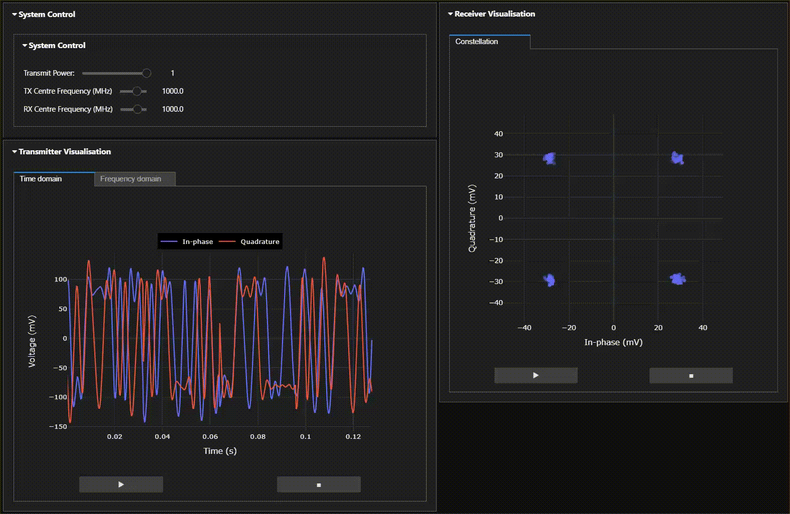

# RFSoC QPSK Transceiver 

## Introduction
This repo contains all the files needed to build and run the RFSoC QPSK demonstrator that was published in [IEEE Access](https://ieeexplore.ieee.org/document/9139483) and was presented at both [FPL](https://fpl2018.org/) and [XDF](http://www.xilinx.com/xdf) conferences in 2018. The design is a full QPSK transceiver, which transmits and receives randomly-generated pulse-shaped symbols with full carrier and timing synchronisation. [PYNQ](https://github.com/xilinx/pynq) is used to visualise the data at both the DAC and ADC side of the RFSoC data converters, as well as visualising various DSP stages throughout the transmit and receive signal path.

<p align="center">
  
<p/>

## Quick Start

This repository is only compatible with [PYNQ images v2.5 and greater](https://github.com/Xilinx/PYNQ/releases) for [ZCU111](https://www.xilinx.com/products/boards-and-kits/zcu111.html).

Connect to the board with **Jupyter Lab** in a browser (not Jupyter Notebook) @ `http://<IP address>/lab`. 

Open a terminal in Jupyter Lab. If you are using PYNQ v2.6, run the following command:
```sh
pip3 install git+https://github.com/strath-sdr/rfsoc_qpsk --no-deps
```

If you are using PYNQ v2.5, simply specify the target branch as shown in the command below:
```sh
pip3 install git+https://github.com/strath-sdr/rfsoc_qpsk@pynq_v2.5.0 --no-deps
```

The notebook should now be available in the `strath-sdr/standalone/rfsoc_qpsk/` folder.
Use Chrome if possible — the rendering performance is important.

## ZCU111 Setup
We use DAC2 from tile 229 to transmit and ADC0 from tile 224 to receive. These correspond to connections J5 and J4 on the HW-FMC-XM500 daughter board respectively. SW6 on the ZCU111 must be set to boot from SD card (as shown in the image below).

<p align="center">

<p/>

## Using the Project Files
All software builds have been tested on Microsoft Windows 10.
#### Requirements
- Vivado Design Suite 2020.1
- System Generator for DSP
- MATLAB 2020a

### System Generator
The Tx and Rx IPs are in separate directories in `rfsoc_qpsk/boards/sysgen/` that can be opened using the appropriate System Generator dialogue. Due to the large amount of decimation and interpolation in both IPs, simulating the output can take an extraordinarily long time. A less extreme multirate system would simulate much faster! 

### Vivado
This project can be built with Vivado from the command line:
```sh
cd rfsoc_qpsk/boards/ZCU111/
vivado -mode batch -nojournal -nolog -source write_project.tcl
```

## License 
[BSD 3-Clause](https://github.com/strath-sdr/rfsoc_qpsk/blob/master/LICENSE)
